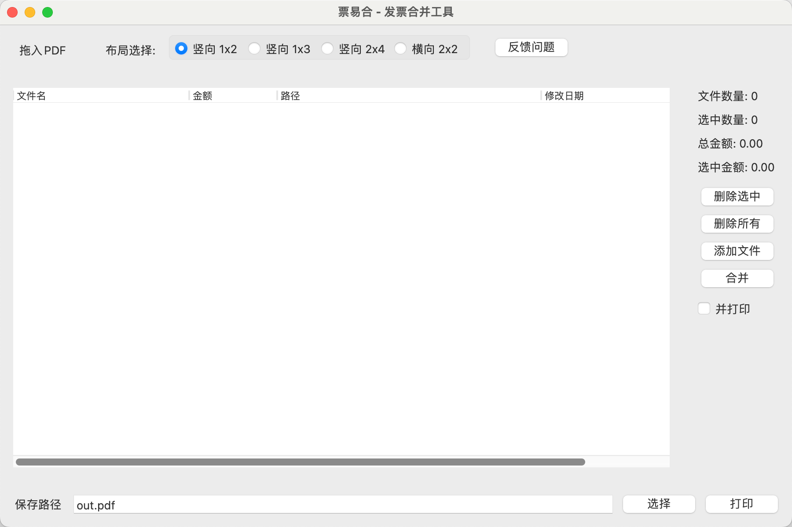

# 票易合 - 发票PDF合并排版工具

#### 介绍
票易合是一款基于 Python + PySide6 开发的跨平台桌面应用程序(支持Windows和MacOS)，专门用于将多张发票 PDF 文件合并排版成指定格式。软件支持多种布局方式，可满足不同场景下的发票合并需求。



#### 软件架构
- **前端框架**: PySide6 (Qt 跨平台 GUI 框架)
- **PDF 处理**: PyMuPDF (fitz)
- **编程语言**: Python 3
- **打包工具**: PyInstaller

#### 功能特性
- 支持拖拽导入 PDF 文件，亦可点击"添加"按钮选择文件
- 多种布局模式可选：竖向 1x2、竖向 1x3、竖向 2x4、横向 2x2
- **双模式处理**：普通模式（保留PDF矢量信息和发票监制章）、图像模式（高精度图片转换）
- **打印顺序**：支持按列表顺序、开票日期、开票金额三种方式排序打印
- **实时预览**：添加文件后自动生成合并预览图，支持滚轮缩放查看
- 文件列表显示：文件名、金额、开票日期、路径、修改日期、大小
- **文件管理**：支持上移/下移调整顺序、右键菜单（打开文件、在文件夹中显示）
- 支持删除选中、删除全部操作
- **批量重命名**：支持根据发票字段（发票类型、商品类型、开票日期、买方名字、销方名字、金额）自定义规则批量重命名文件
- 支持合并后直接打印
- **自动更新检查**：启动时自动检测新版本，支持版本更新提示

#### 安装教程

1. 安装 Python 3 环境
2. 安装依赖包：
   ```bash
   pip install PySide6 PyMuPDF pyinstaller
   ```
3. 克隆项目后运行：
   ```bash
   python code/main.py
   ```

#### 使用说明

1. **添加文件**：将 PDF 发票文件拖入窗口，或点击"添加"按钮
2. **选择布局**：根据需要选择合适的排版布局
3. **批量重命名**：点击"重命名"按钮，配置规则后批量重命名文件
   - 支持字段：发票类型、商品类型、开票日期、买方名字、销方名字、金额
   - 示例规则：`{买方名字}-{开票日期}-{商品类型}`
4. **查看统计**：右侧面板显示文件数量和金额统计
5. **合并文件**：点击"合并PDF"按钮生成合并后的 PDF
6. **打印输出**：可勾选"合并后打印"复选框直接打印

#### 打包发布

- Windows 打包：`package_win.bat`
- macOS 打包：`package_macos.sh`

#### 联系我们

如果有问题，欢迎关注公众号并私信


#### 参与贡献

1. Fork 本仓库
2. 新建 Feat_xxx 分支
3. 提交代码
4. 新建 Pull Request
